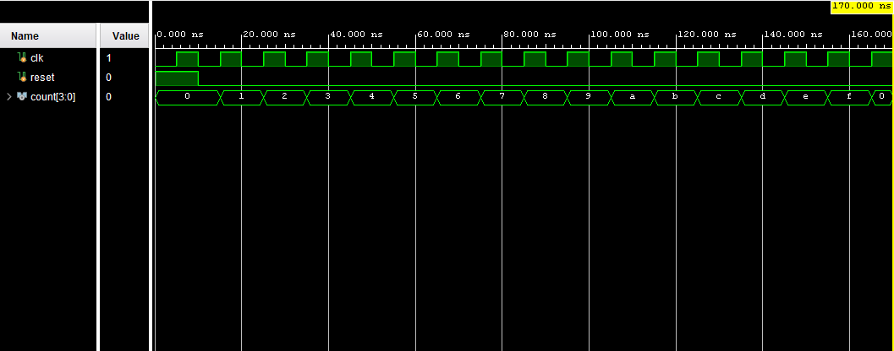
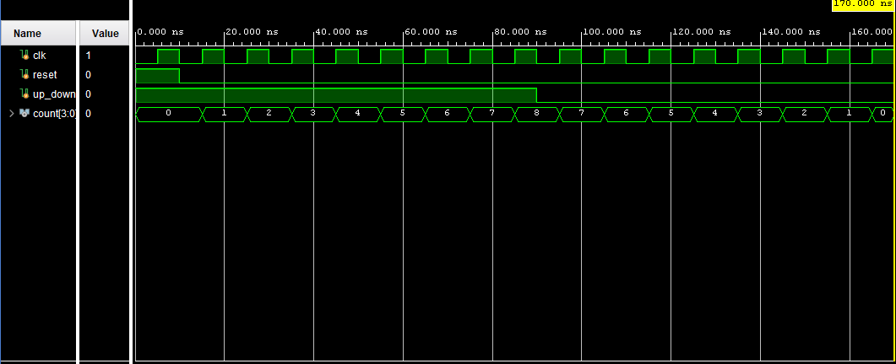
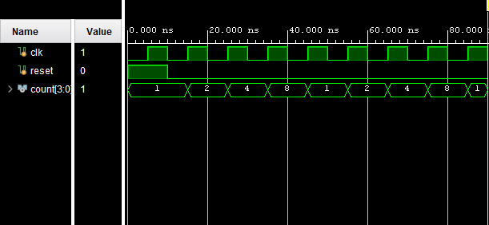

# Verilog Counter Designs

This repository contains the implementation and simulation of six commonly used counters in Verilog HDL. All designs were developed and verified using Xilinx Vivado through behavioral simulation and waveform analysis.

### Implemented Counters

* Up Counter
* Down Counter
* Up/Down Counter
* Mod-10 (Decade) Counter
* Ring Counter
* Johnson Counter

---

# Tools Used

* Verilog HDL
* Xilinx Vivado
* Behavioral Simulation

---

# 1. Up Counter

## Description

A 4-bit synchronous up counter increments its count value by one on every positive edge of the clock.

## Verilog Code

```verilog
module counter(
    input clk,
    input reset,
    output reg [3:0] count
);

always @(posedge clk or posedge reset)
begin
    if(reset)
        count <= 4'b0000;
    else
        count <= count + 1;
end

endmodule
```

## Testbench

```verilog
`timescale 1ns / 1ps

module counter_tb;

reg clk;
reg reset;

wire [3:0] count;

counter uut(
    .clk(clk),
    .reset(reset),
    .count(count)
);

// Clock generation
always #5 clk = ~clk;

initial
begin
    clk = 0;
    reset = 1;

    #10;
    reset = 0;

    #160;

    $finish;
end

endmodule
```

## Waveform



## Waveform Analysis

The counter starts from 0 after reset and increments on every positive clock edge.

Observed sequence:

```text
0 → 1 → 2 → 3 → 4 → 5 ...
```

This verifies correct up-counting operation.

---

# 2. Down Counter

## Description

A 4-bit synchronous down counter decrements its count value by one on every positive edge of the clock.

## Verilog Code

```verilog
module down_counter(
    input clk,
    input reset,
    output reg [3:0] count
);

always @(posedge clk or posedge reset)
begin
    if(reset)
        count <= 4'b1111;   // Start from 15
    else
        count <= count - 1;
end

endmodule
```

## Testbench

```verilog
`timescale 1ns / 1ps

module down_counter_tb;

reg clk;
reg reset;

wire [3:0] count;

down_counter uut(
    .clk(clk),
    .reset(reset),
    .count(count)
);

// Clock generation
always #5 clk = ~clk;

initial
begin
    clk = 0;
    reset = 1;

    #10;
    reset = 0;

    #160;

    $finish;
end

// Display count in console
initial
begin
    $monitor("Time=%0t Count=%d", $time, count);
end

endmodule
```

## Waveform


## Waveform Analysis

The counter starts from its initial value and decreases on each clock pulse.

Observed sequence:

```text
F → E → D → C → B ...
```

This verifies correct down-counting operation.

---

# 3. Up/Down Counter

## Description

A 4-bit counter capable of both incrementing and decrementing depending on the control signal.

## Verilog Code

```verilog
module up_down_counter(
    input clk,
    input reset,
    input up_down,
    output reg [3:0] count
);

always @(posedge clk or posedge reset)
begin
    if(reset)
        count <= 4'b0000;
    else if(up_down)
        count <= count + 1;
    else
        count <= count - 1;
end

endmodule
```

## Testbench

```verilog
`timescale 1ns / 1ps

module up_down_counter_tb;

reg clk;
reg reset;
reg up_down;

wire [3:0] count;

up_down_counter uut(
    .clk(clk),
    .reset(reset),
    .up_down(up_down),
    .count(count)
);

// Clock generation
always #5 clk = ~clk;

initial
begin
    clk = 0;
    reset = 1;
    up_down = 1;

    #10;
    reset = 0;

    // Count Up
    #80;

    // Count Down
    up_down = 0;

    #80;

    $finish;
end

endmodule
```

## Waveform



## Waveform Analysis

When:

```text
up_down = 1
```

the counter increments:

```text
0 → 1 → 2 → 3 → ... → 8
```

When:

```text
up_down = 0
```

the counter decrements:

```text
8 → 7 → 6 → 5 → ... → 0
```

This confirms proper bidirectional counting functionality.

---

# 4. Mod-10 (Decade) Counter

## Description

A Mod-10 counter counts from 0 to 9 and then automatically resets to 0.

## Verilog Code

```verilog
module mod10_counter(
    input clk,
    input reset,
    output reg [3:0] count
);

always @(posedge clk or posedge reset)
begin
    if(reset)
        count <= 4'b0000;
    else if(count == 4'd9)
        count <= 4'b0000;
    else
        count <= count + 1;
end

endmodule
```

## Testbench

```verilog
`timescale 1ns / 1ps

module mod10_counter_tb;

reg clk;
reg reset;

wire [3:0] count;

mod10_counter uut(
    .clk(clk),
    .reset(reset),
    .count(count)
);

always #5 clk = ~clk;

initial
begin
    clk = 0;
    reset = 1;

    #10;
    reset = 0;

    #120;

    $finish;
end

endmodule
```

## Waveform


## Waveform Analysis

Observed sequence:

```text
0 → 1 → 2 → 3 → 4 → 5 → 6 → 7 → 8 → 9 → 0
```

This verifies the decade counting operation.

---

# 5. Ring Counter

## Description

A Ring Counter circulates a single logic HIGH through a shift register.

## Verilog Code

```verilog
module ring_counter(
    input clk,
    input reset,
    output reg [3:0] count
);

always @(posedge clk or posedge reset)
begin
    if(reset)
        count <= 4'b0001;
    else
        count <= {count[2:0], count[3]};
end

endmodule
```

## Testbench

```verilog
`timescale 1ns / 1ps

module ring_counter_tb;

reg clk;
reg reset;

wire [3:0] count;

ring_counter uut(
    .clk(clk),
    .reset(reset),
    .count(count)
);

always #5 clk = ~clk;

initial
begin
    clk = 0;
    reset = 1;

    #10;
    reset = 0;

    #80;

    $finish;
end

endmodule
```

## Waveform



## Waveform Analysis

Observed sequence:

```text
0001 → 0010 → 0100 → 1000 → 0001
```

Hexadecimal representation:

```text
1 → 2 → 4 → 8 → 1
```

Only one bit remains HIGH at any given time.

---

# 6. Johnson Counter

## Description

A Johnson Counter (Twisted Ring Counter) feeds the inverted output of the last stage back to the first stage.

## Verilog Code

```verilog
module johnson_counter(
    input clk,
    input reset,
    output reg [3:0] count
);

always @(posedge clk or posedge reset)
begin
    if(reset)
        count <= 4'b0000;
    else
        count <= {~count[0], count[3:1]};
end

endmodule
```

## Testbench

```verilog
`timescale 1ns / 1ps

module johnson_counter_tb;

reg clk;
reg reset;

wire [3:0] count;

johnson_counter uut(
    .clk(clk),
    .reset(reset),
    .count(count)
);

always #5 clk = ~clk;

initial
begin
    clk = 0;
    reset = 1;

    #10;
    reset = 0;

    #100;

    $finish;
end

endmodule
```

## Waveform


## Waveform Analysis

Observed sequence:

```text
0000
1000
1100
1110
1111
0111
0011
0001
0000
```

This demonstrates the characteristic Johnson counter pattern.

---

# Comparison of Counters

| Counter Type    | Function                       |
| --------------- | ------------------------------ |
| Up Counter      | Counts upward                  |
| Down Counter    | Counts downward                |
| Up/Down Counter | Counts in both directions      |
| Mod-10 Counter  | Counts from 0 to 9             |
| Ring Counter    | Rotates a single HIGH bit      |
| Johnson Counter | Twisted ring counting sequence |

---

# Applications

* Digital Clocks
* Event Counters
* Frequency Dividers
* Sequence Generators
* State Machines
* Embedded Systems
* FPGA Designs

---

# Learning Outcomes

This repository demonstrates:

* Sequential Logic Design
* Clocked Digital Circuits
* Counter Architectures
* Shift-Based Counters
* Verilog HDL Coding
* Behavioral Simulation
* Waveform Verification

---

# Conclusion

This repository presents the implementation and verification of six fundamental counter designs using Verilog HDL. The simulation results confirm the correct operation of each counter and provide practical experience in sequential digital circuit design.
